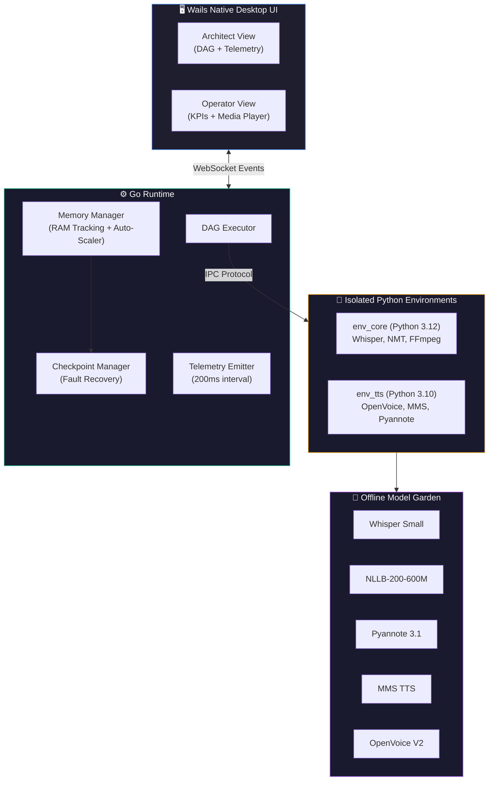
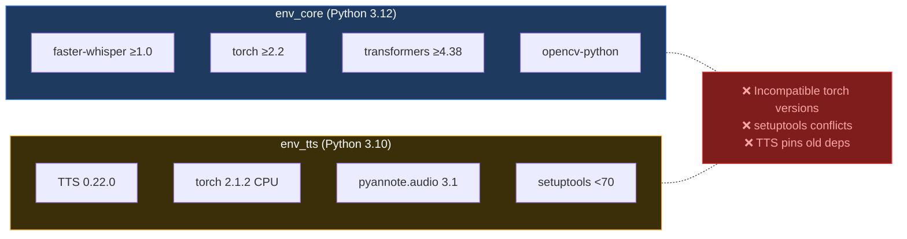

<p align="center">
  <h1 align="center">🌊 Echoflow</h1>
  <p align="center">
    <strong>Offline-First AI Media Pipeline Platform</strong>
    <br />
    <em>A deterministic DAG orchestrator for localized AI video lip-syncing, voice cloning, translation & transcription</em>
  </p>
</p>

<p align="center">
  <a href="#-quick-start"></a>
  <a href="#-architecture"></a>
  <a href="#-pipeline-components"></a>
  <a href="LICENSE"></a>
</p>

<p align="center">
  
  
  
  
  
  
  
  
</p>

---

## 📑 Table of Contents

- [About](#-about)
- [Key Features](#-key-features)
- [Architecture](#-architecture)
- [Tech Stack](#-tech-stack)
- [System Prerequisites](#-system-prerequisites)
- [Quick Start](#-quick-start)
  - [Step 1 — Automated Environment Initialization](#step-1--automated-environment-initialization)
  - [Step 2 — Model Weight Placement](#step-2--model-weight-placement)
  - [Step 3 — Build & Run](#step-3--build--run)
- [Project Structure](#-project-structure)
- [Pipeline Components](#-pipeline-components)
- [Multi-Environment Architecture](#-multi-environment-architecture)
- [IPC Protocol](#-ipc-protocol)
- [Dual-View UI](#-dual-view-ui)
- [Configuration Reference](#-configuration-reference)
- [Troubleshooting](#-troubleshooting)
- [Contributing](#-contributing)
- [License](#-license)

---

## 🎯 About

**Echoflow** is a highly concurrent, deterministic Directed Acyclic Graph (DAG) orchestrator designed for fully **offline, CPU-optimized** AI media processing. Built with Go, Wails (Vanilla HTML/JS), and Python, it delivers a native desktop application that processes video, audio, and text through a multi-stage AI pipeline — entirely disconnected from the internet.

The platform was engineered with **full system transparency** at its core: real-time RAM telemetry, live DAG visualization, checkpoint-based fault recovery, and a component-level execution graph — all visible through a dual-mode UI (Architect + Operator views).

---

## ✨ Key Features

| Feature | Description |
|---|---|
| 🧠 **Offline AI** | All models run locally — zero cloud dependency. Works in air-gapped environments. |
| 🔀 **DAG Engine** | Go-based orchestrator with deterministic execution order and automatic dependency resolution |
| 🎯 **Chunked Processing** | Splits large media into buckets to prevent memory overflows on constrained hardware |
| 🔄 **Checkpoint Recovery** | Every job is persisted to disk. Resume from exact failure point after crashes or pauses |
| 📊 **Real-Time Telemetry** | 200ms telemetry loop emitting RAM usage, queue backlogs, worker stats, and chunk progress |
| 🎬 **Multi-Format I/O** | Accepts `.mp4`, `.wav`, `.mp3`, `.txt`, `.srt`, `.json` — outputs to any video/audio/text format |
| 🗣️ **Voice Cloning** | Preserves original speaker tone color using OpenVoice V2 neural voice conversion |
| 🌐 **Translation** | NLLB-200 neural machine translation with support for English, Hindi, and Marathi |
| 📝 **Transcription** | Faster-Whisper ASR with speaker diarization via Pyannote |
| 👄 **Lip-Sync** | ONNX-accelerated Wav2Lip for video lip synchronization (planned) |
| 🧩 **Auto-Scaling** | Dynamic worker pool that spawns/terminates model daemons based on queue pressure |
| 🖥️ **Native Desktop** | Compiles to a single `.exe` via Wails — no browser, no Electron, no Docker |

---

## 🏗️ Architecture

### Pipeline Execution Flow

The DAG engine resolves dependencies and executes components in the following order. Components at the same depth level run concurrently when independent:

```mermaid
graph LR
    INGEST["📥 INGEST"] --> MP["MetadataProfiler"]
    MP --> AC["AudioChunker"]
    MP --> SD["SpeakerDiarizer"]
    AC --> WT["WhisperTranscriber"]
    WT --> TA["TranscriptAggregator"]
    SD --> TA
    TA --> NMT["NMTTranslator"]
    NMT --> VD["VoiceDubber"]
    SD --> VD
    VD --> MC["MediaCompositor"]
    MC --> OUT["✅ OUTPUT"]

    style INGEST fill:#1e3a5f,stroke:#3b82f6,color:#fff
    style OUT fill:#064e3b,stroke:#10b981,color:#fff
    style MP fill:#18181b,stroke:#3f3f46,color:#f8fafc
    style AC fill:#18181b,stroke:#3f3f46,color:#f8fafc
    style SD fill:#18181b,stroke:#3f3f46,color:#f8fafc
    style WT fill:#18181b,stroke:#3b82f6,color:#f8fafc
    style TA fill:#18181b,stroke:#3f3f46,color:#f8fafc
    style NMT fill:#18181b,stroke:#3f3f46,color:#f8fafc
    style VD fill:#18181b,stroke:#3f3f46,color:#f8fafc
    style MC fill:#18181b,stroke:#3f3f46,color:#f8fafc
```



### System Architecture



---

## 🔧 Tech Stack

| Layer | Technology | Version | Purpose |
|---|---|---|---|
| **Runtime** | Go | 1.25+ | DAG orchestration, memory management, IPC |
| **UI Framework** | Wails | 2.9.1 | Native desktop app (WebView2 on Windows) |
| **Frontend** | Vanilla HTML/CSS/JS | — | Zero-dependency UI with real-time telemetry |
| **AI Runtime** | Python | 3.10, 3.12 | Model inference across isolated environments |
| **ASR** | Faster-Whisper | ≥1.0.0 | Speech-to-text (CTranslate2 backend) |
| **Translation** | NLLB-200 | 600M Distilled | Neural machine translation |
| **TTS** | Meta MMS | Base | Multilingual text-to-speech synthesis |
| **Voice Clone** | OpenVoice V2 | Latest | Tone color conversion / voice cloning |
| **Diarization** | Pyannote | 3.1 | Speaker segmentation & identification |
| **Media Engine** | FFmpeg | Static Build | Video/audio muxing, subtitle burn-in, format conversion |
| **ONNX** | ONNX Runtime | ≥1.16 | CPU-optimized inference for Wav2Lip |

---

## 📋 System Prerequisites

Before initializing the project, ensure your host machine has the following installed:

| Requirement | Version | Installation |
|---|---|---|
| **Go** | `1.20+` | [golang.org/dl](https://golang.org/dl/) |
| **Node.js** | `18+` | [nodejs.org](https://nodejs.org/) — required for compiling the Wails frontend assets |
| **Python** | `3.12` | Primary runtime for `env_core` (Whisper, NMT, FFmpeg processing) |
| **Python** | `3.10` | Required for `env_tts` (OpenVoice, Pyannote, MMS TTS) |
| **Hugging Face Token** | User Access Token (Read) | **Mandatory** for downloading gated Pyannote models (`HF_TOKEN`) |
| **Wails CLI** | `v2` | Install via: `go install github.com/wailsapp/wails/v2/cmd/wails@latest` |

> [!IMPORTANT]
> **Hugging Face Access Token (`HF_TOKEN`) is REQUIRED for initial setup!**  
> Echoflow relies on Pyannote 3.1 for speaker diarization. Pyannote models are **gated models** on Hugging Face. You MUST accept the model user conditions on Hugging Face and export your HF token prior to running `setup_script.py`. See [Hugging Face Access Token Setup](#-hugging-face-access-token-setup) below.

> [!NOTE]
> **FFmpeg** is handled automatically by the setup script — it downloads a static binary into the project's `bin/` directory. You do **not** need to install FFmpeg globally.

> [!TIP]
> On Windows, use the [Python Launcher (`py`)](https://docs.python.org/3/using/windows.html#python-launcher-for-windows) to manage multiple Python versions side-by-side. The setup script uses `py -3.12` and `py -3.10` to target specific versions.

---

## 🔑 Hugging Face Access Token Setup

Pyannote models (`pyannote/speaker-diarization-3.1` and `pyannote/segmentation-3.0`) require a Hugging Face account and user access token. Follow these 4 quick steps before running `setup_script.py`:

### 1. Create a Hugging Face Account
If you don't have one, register for free at [huggingface.co/join](https://huggingface.co/join).

### 2. Accept Model Conditions on Hugging Face
Open both links in your browser while logged in and click **"Access repository"** / **"Accept conditions"**:
- 🔗 [pyannote/speaker-diarization-3.1](https://huggingface.co/pyannote/speaker-diarization-3.1)
- 🔗 [pyannote/segmentation-3.0](https://huggingface.co/pyannote/segmentation-3.0)

> [!WARNING]
> If you skip accepting the terms on HuggingFace, model downloads will fail with `401 Client Error: Cannot access gated repo` even if your token is valid.

### 3. Generate a User Access Token
1. Go to your Hugging Face [Access Tokens Settings](https://huggingface.co/settings/tokens).
2. Click **Create new token**.
3. Select Token Type **Read**.
4. Copy the generated token string (starts with `hf_...`).

### 4. Export the `HF_TOKEN` Environment Variable

Before executing `python setup_script.py`, set `HF_TOKEN` in your terminal session:

#### Windows (Command Prompt / CMD)
```cmd
set HF_TOKEN=hf_your_access_token_here
python setup_script.py
```

#### Windows (PowerShell)
```powershell
$env:HF_TOKEN="hf_your_access_token_here"
python setup_script.py
```

#### Linux / macOS (Bash / Zsh)
```bash
export HF_TOKEN="hf_your_access_token_here"
python setup_script.py
```

---

## 🚀 Quick Start

### Step 1 — Automated Environment Initialization

To prevent dependency conflicts between heavy audio/video AI libraries, Echoflow uses an **isolated multi-environment architecture**. The automated setup script scaffolds everything for you.

Make sure your `HF_TOKEN` environment variable is set as shown above, then run:

```cmd
python setup_script.py
```

<details>
<summary><strong>📦 What the setup script does (click to expand)</strong></summary>
<br/>

The script performs the following operations in sequence:

1. **Creates directory structure** — ensures `models/`, `pipeline/`, `.envs/`, and `bin/` exist
2. **Provisions virtual environments**:
   - `.envs/env_core` → Python 3.12 (Faster-Whisper, NMT, FFmpeg, OpenCV, Mediapipe)
   - `.envs/env_tts` → Python 3.10 (OpenVoice V2, Pyannote 3.1, MMS TTS, Coqui TTS)
3. **Upgrades build tools** — pip, setuptools (pinned `<70` for env_tts to preserve `pkg_resources` for OpenVoice), wheel
4. **Installs Python dependencies** into each isolated environment:
   - `env_core`: faster-whisper, torch, torchaudio, transformers, sentencepiece, opencv-python, mediapipe, etc.
   - `env_tts`: TTS 0.22.0, pyannote.audio 3.1.1, strict PyTorch CPU wheels (2.1.2), OpenVoice (installed with `--no-deps`)
5. **Downloads model weights** via HuggingFace Hub:
   - `Systran/faster-whisper-small` → `models/whisper-small/`
   - `facebook/nllb-200-distilled-600M` → `models/nllb-200-distilled-600M/`
   - `pyannote/speaker-diarization-3.1` → `models/offline_pyannote_model/`
   - `pyannote/segmentation-3.0` → `models/pyannote_segmentation/`
   - `facebook/mms-tts-{hin,mar,eng}` → `models/offline_mms_model/{lang}/`
   - `myshell-ai/OpenVoiceV2` (converter only) → `models/offline_openvoice/`
6. **Downloads FFmpeg** — static binary extracted into `bin/ffmpeg.exe`
7. **Generates configuration files**:
   - `models/registry.json` — hardware daemon mapping with RAM estimates
   - `pipeline/manifest.json` — full DAG topology definition

</details>

> [!WARNING]
> The initial setup downloads **several gigabytes** of model weights from HuggingFace. Ensure you have a stable internet connection and sufficient disk space (~15 GB recommended). After setup, the platform runs **completely offline**.

---

### Step 2 — Model Weight Placement

If you ran the setup script, models are downloaded automatically. For manual setup or verification, ensure the `models/` directory matches this exact structure:

```
models/
├── nllb-200-distilled-600M/        ← NLLB Neural Machine Translation (600M params)
├── offline_mms_model/              ← Meta MMS Base TTS
│   ├── eng/                        ← English voice
│   ├── hin/                        ← Hindi voice
│   └── mar/                        ← Marathi voice
├── offline_openvoice/              ← OpenVoice V2 Tone Color Converter
│   └── converter/                  ← Converter checkpoint weights
├── offline_pyannote_model/         ← Pyannote Speaker Diarization 3.1
├── pyannote_segmentation/          ← Pyannote Segmentation 3.0
├── wav2lip-onnx-256/               ← ONNX 256×256 Lip-Sync Model
├── whisper-small/                  ← Faster-Whisper ASR (CTranslate2)
└── registry.json                   ← Hardware daemon mapping (auto-generated)
```

**`registry.json`** maps model references to their paths and estimated RAM usage. This file is auto-generated by `setup_script.py` and consumed by the Go Memory Manager at runtime:

```json
{
    "WhisperSmallDaemon": {
        "model_path": "models/whisper-small",
        "framework": "faster-whisper",
        "estimated_ram_mb": 1200.0
    },
    "PyannoteDiarizerDaemon": {
        "model_path": "models/offline_pyannote_model",
        "framework": "pyannote",
        "estimated_ram_mb": 1000.0
    },
    "MMSTTSBase": {
        "model_path": "models/offline_mms_model",
        "framework": "transformers",
        "estimated_ram_mb": 1500.0
    },
    "OpenVoiceV2Daemon": {
        "model_path": "models/offline_openvoice",
        "framework": "openvoice",
        "estimated_ram_mb": 2500.0
    }
}
```

> [!IMPORTANT]
> All models must be present **before** running the application. The platform does not download anything at runtime — it is designed to be fully air-gapped.

---

### Step 3 — Build & Run

With environments provisioned and models downloaded, use the Wails CLI to compile and launch:

#### 🛠️ Development (Live UI Reloading)

```cmd
wails dev
```

This starts the Go backend and serves the frontend with hot-reload. Ideal for development and debugging.

#### 📦 Production Build

```cmd
wails build
```

Compiles a standalone, optimized native executable:

```
build/bin/Echoflow.exe
```

> [!TIP]
> The production binary embeds all frontend assets. You can distribute the single `.exe` alongside the `models/`, `.envs/`, `pipeline/`, and `bin/` directories for a fully portable deployment.

---

## 📁 Project Structure

```
echoflow/
│
├── main.go                         # Application entry point & Wails bootstrap
├── app.go                          # Wails-bound API methods (SubmitJob, StopJob, etc.)
├── go.mod                          # Go module definition & dependencies
├── go.sum                          # Go dependency checksums
├── wails.json                      # Wails build configuration
├── setup_script.py                 # Automated environment & model setup
├── LICENSE                         # MIT License
├── README.md                       # This file
│
├── frontend/
│   └── src/
│       ├── index.html              # Complete UI (Architect + Operator dual-view)
│       └── wailsjs/                # Auto-generated Wails JS bindings
│
├── internal/
│   ├── broker/
│   │   ├── memory_manager.go       # RAM tracking, auto-scaler, worker pool, IPC, telemetry
│   │   └── checkpoint.go           # Job persistence, fault recovery, state management
│   └── pipeline/
│       └── dag_executor.go         # DAG traversal, dependency resolution, CPU task execution
│
├── pipeline/
│   ├── manifest.json               # DAG topology definition (component graph)
│   ├── profiler.py                 # MetadataProfiler — media analysis & chunking prep
│   ├── audio/
│   │   ├── audio_chunker.py        # Splits audio into RAM-safe buckets
│   │   ├── whisper_transcriber.py  # Faster-Whisper ASR (chunked, daemon mode)
│   │   ├── speaker_diarizer.py     # Pyannote speaker segmentation
│   │   ├── transcript_aggregator.py# Merges transcripts with speaker labels
│   │   ├── nmt_runner.py           # NLLB-200 neural translation
│   │   └── voice_dubber.py         # MMS TTS + OpenVoice tone cloning
│   └── video/
│       ├── media_compositor.py     # FFmpeg final render (mux, subtitle burn, format conversion)
│       └── generator_preprocessor/ # Wav2Lip preprocessing modules
│           ├── face_detector.py    # MediaPipe face detection
│           ├── landmarker.py       # Facial landmark extraction
│           └── mouth_isolator.py   # Mouth region isolation for lip-sync
│
├── models/                         # Offline AI model weights (not in git)
├── .envs/                          # Isolated Python virtual environments (not in git)
├── bin/                            # FFmpeg static binary (not in git)
├── workspace/                      # Runtime job data & checkpoints
│   └── jobs/
│       └── JOB-{timestamp}/        # Individual job directories
│           ├── manifest.json       # Checkpoint state (survives crashes)
│           ├── job_config.json     # Job parameters (lang, format, etc.)
│           └── out_{Component}/    # Output from each pipeline stage
│
├── build/
│   └── bin/                        # Compiled production binary output
│
└── local_cache/                    # Local caching directory
```

---

## ⚙️ Pipeline Components

Each component is defined in [`pipeline/manifest.json`](pipeline/manifest.json) and executed by the DAG engine:

| Component | Environment | Domain | Mode | Dependencies | Description |
|---|---|---|---|---|---|
| **MetadataProfiler** | `env_core` | CPU | Sequential | — | Analyzes input media metadata, detects format, prepares for chunking |
| **AudioChunker** | `env_core` | CPU | Sequential | MetadataProfiler | Splits audio tracks into RAM-safe buckets for parallel processing |
| **WhisperTranscriber** | `env_core` | RAM | **Chunked** | AudioChunker | Runs Faster-Whisper ASR on each audio bucket (warm daemon mode with IPC) |
| **SpeakerDiarizer** | `env_tts` | CPU | Sequential | MetadataProfiler | Pyannote 3.1 speaker segmentation and identification |
| **TranscriptAggregator** | `env_core` | CPU | Sequential | WhisperTranscriber, SpeakerDiarizer | Merges chunk transcripts and aligns with speaker diarization |
| **NMTTranslator** | `env_core` | CPU | Sequential | TranscriptAggregator | NLLB-200 neural machine translation (EN ↔ HI/MR) |
| **VoiceDubber** | `env_tts` | CPU | Sequential | NMTTranslator, SpeakerDiarizer | MMS TTS synthesis + OpenVoice V2 tone color transfer |
| **MediaCompositor** | `env_core` | CPU | Sequential | VoiceDubber | FFmpeg final render: subtitle burn-in, audio mux, format conversion |

### Execution Modes

| Mode | Behavior |
|---|---|
| **Sequential** | Runs as a one-shot subprocess. Input → Process → Output. Tracked via `GlobalTasks` in checkpoint |
| **Chunked** | Runs as a **warm daemon** — model loads once, then processes multiple buckets via stdin/stdout IPC. Enables parallel worker scaling |

> [!NOTE]
> The DAG engine **automatically bypasses** components based on input/output format. For example, text-only jobs skip all audio and video nodes, and audio-only jobs skip video preprocessing.

---

## 🐍 Multi-Environment Architecture

Echoflow uses **isolated Python virtual environments** to prevent dependency conflicts between incompatible AI frameworks:

| Environment | Python | Key Packages | Purpose |
|---|---|---|---|
| `env_core` | 3.12 | faster-whisper, torch 2.2+, transformers, opencv-python, mediapipe | ASR, NMT, media analysis, video preprocessing |
| `env_tts` | 3.10 | TTS 0.22.0, pyannote.audio 3.1.1, torch 2.1.2 (CPU), OpenVoice, setuptools<70 | Voice synthesis, speaker diarization, tone cloning |

### Why Two Environments?



Key conflicts that necessitate isolation:
- **PyTorch version**: `env_core` needs torch ≥2.2 for latest Whisper, while `env_tts` requires torch 2.1.2 CPU for TTS/OpenVoice compatibility
- **setuptools**: OpenVoice depends on `pkg_resources` which was removed in setuptools ≥70
- **TTS 0.22.0**: Pins exact versions of internal dependencies that conflict with env_core packages

The Go DAG engine resolves which Python executable to invoke for each component based on the `env_name` field in `manifest.json`.

---

## 📡 IPC Protocol

Chunked components (like WhisperTranscriber) run as **warm daemons** — the model loads once, then the Go runtime sends work items via stdin and reads results via stdout.

### Protocol Format

All IPC messages use the prefix `ECHOFLOW_IPC__` followed by a JSON payload:

```
ECHOFLOW_IPC__{"status": "ready", "actual_ram_mb": 1247.5}
ECHOFLOW_IPC__{"status": "progress", "chunk": "bucket_003", "pct": 45}
ECHOFLOW_IPC__{"status": "success", "output": "/path/to/result.json"}
ECHOFLOW_IPC__{"status": "error", "message": "Out of memory"}
```

### Message Types

| Status | Direction | Description |
|---|---|---|
| `ready` | Python → Go | Handshake after model boot. Reports actual RAM usage |
| `progress` | Python → Go | In-flight progress update for UI rendering |
| `success` | Python → Go | Chunk completed successfully |
| `error` | Python → Go | Chunk processing failed |

> [!NOTE]
> Non-IPC stdout lines are captured and forwarded to the UI log panel as informational messages. The Go runtime filters stderr to suppress noisy framework warnings (XNNPACK, TFLite, etc.).

---

## 🖥️ Dual-View UI

Echoflow ships with two interface modes, togglable via a switch in the header:

### Architect View (Tech)
- **Job Injection Gateway** — file path input with format/language/subtitle controls
- **Pipeline KPIs** — completed tasks and active daemon count
- **System RAM Allocation** — real-time bar with MB tracking
- **Component-Level DAG Graph** — live visualization of queue depth, thread count, and RAM per node
- **Model Garden Daemon Table** — PID, component, RAM, and per-chunk progress bars
- **System Interceptor Logs** — timestamped log stream with color-coded severity

### Operator View (KPI)
- **Simplified Job Controls** — same injection gateway in a streamlined layout
- **3 KPI Cards** — Media Processed, Active AI Agents, System Health %
- **Pipeline Progress Steps** — 3-stage visual (Ingestion → AI Processing → Output)
- **Integrated Media Player** — auto-plays final rendered video/audio when job completes

---

## ⚙️ Configuration Reference

### `wails.json`

| Key | Value | Description |
|---|---|---|
| `name` | `echoflow` | Application identifier |
| `outputfilename` | `Echoflow.exe` | Compiled binary name |
| `frontend:dir` | `frontend` | Frontend source directory |
| `wailsjsdir` | `./frontend/src` | Wails JS bindings output |
| `version` | `2.9.1` | Wails framework version |

### `pipeline/manifest.json`

Each component entry contains:

| Field | Type | Description |
|---|---|---|
| `env_name` | string | Which Python environment to use (`env_core` or `env_tts`) |
| `domain` | string | Resource domain — `cpu` for standard tasks, `ram` for memory-intensive models |
| `execution_mode` | string | `sequential` (one-shot) or `chunked` (warm daemon with IPC) |
| `depends_on` | string[] | List of upstream components that must complete first |
| `model_ref` | string | Reference to `registry.json` entry (for RAM estimation) |
| `script` | string | Relative path to the Python script |
| `accepted_inputs` | string[] | File types or `directory` |
| `produces` | string | Output format |

### `models/registry.json`

| Field | Type | Description |
|---|---|---|
| `model_path` | string | Relative path to model weights directory |
| `framework` | string | Inference framework identifier |
| `estimated_ram_mb` | float | RAM estimate used by the auto-scaler for capacity planning |

---

## 🔍 Troubleshooting

<details>
<summary><strong>❌ "env_tts creation failed" during setup</strong></summary>

Ensure Python 3.10 is installed and accessible via the `py` launcher:
```cmd
py -3.10 --version
```
If not found, install Python 3.10 from [python.org](https://www.python.org/downloads/release/python-3100/) and ensure "Add to PATH" is checked.

</details>

<details>
<summary><strong>❌ "Daemon failed to send valid handshake"</strong></summary>

This means a Python daemon process started but didn't emit the `ECHOFLOW_IPC__{"status": "ready"}` handshake within the expected window. Common causes:
- Missing model weights in `models/`
- Corrupted virtual environment — delete `.envs/env_*` and re-run `setup_script.py`
- Python version mismatch — verify with `py -3.12 --version` and `py -3.10 --version`

</details>

<details>
<summary><strong>❌ "Error starting Echoflow GUI"</strong></summary>

Wails requires WebView2 runtime on Windows. It should be pre-installed on Windows 10/11. If missing:
1. Download from [developer.microsoft.com/webview2](https://developer.microsoft.com/en-us/microsoft-edge/webview2/)
2. Install the Evergreen Bootstrapper
3. Restart and try again

</details>

<details>
<summary><strong>⚠️ High RAM usage / OOM crashes</strong></summary>

The Memory Manager defaults to a 5000 MB RAM ceiling. If your system has less available RAM:
1. Open `main.go`
2. Adjust the first parameter in `broker.NewMemoryManager(5000.0, ...)` to a lower value
3. Rebuild with `wails build`

The auto-scaler will respect this ceiling and refuse to spawn new workers when capacity is exceeded.

</details>

---

## 🤝 Contributing

1. Fork the repository
2. Create a feature branch: `git checkout -b feature/your-feature`
3. Commit your changes: `git commit -m "feat: add your feature"`
4. Push to the branch: `git push origin feature/your-feature`
5. Open a Pull Request

> [!NOTE]
> When modifying pipeline scripts, ensure IPC protocol messages use the `ECHOFLOW_IPC__` prefix. The Go runtime will ignore any stdout that doesn't match this pattern (treating it as informational logging).

---

## 📄 License

This project is licensed under the **MIT License** — see the [LICENSE](LICENSE) file for details.

```
MIT License — Copyright (c) 2026 Debanjan Chakraborty
```

---

<p align="center">
  <sub>Built with 🌊 by the Echoflow Team</sub>
</p>